# To-Do & Task Management Application

A simple full-stack To-Do and Task Management application that allows users to create, view, update, delete, and complete tasks. The application uses a Spring Boot REST API to manage task data and MySQL for persistent storage.

## Features

* Add new tasks
* View all tasks
* Update existing tasks
* Delete tasks
* Mark tasks as completed
* Basic form validation
* Error handling
* REST API integration
* MySQL database storage
* Responsive user interface

## Technologies Used

### Frontend

* HTML
* CSS
* JavaScript

### Backend

* Java
* Spring Boot
* Spring Data JPA
* Maven

### Database

* MySQL

### API Testing

* Postman

### Version Control

* Git
* GitHub

## Project Structure

```text
QSkill-Todo-App
│
├── .github/
├── screenshots/
├── pom.xml
│
└── src/
    └── main/
        ├── java/
        │   └── com/
        │       └── qskill/
        │           └── todo/
        │               ├── TodoApplication.java
        │               ├── Task.java
        │               ├── TaskRepository.java
        │               └── TaskController.java
        │
        └── resources/
            ├── application.properties
            └── static/
                ├── index.html
                ├── style.css
                └── script.js
```

## REST API Endpoints

| Method | Endpoint                   | Description              |
| ------ | -------------------------- | ------------------------ |
| GET    | `/api/tasks`               | Get all tasks            |
| POST   | `/api/tasks`               | Add a new task           |
| PUT    | `/api/tasks/{id}`          | Update a task            |
| PUT    | `/api/tasks/{id}/complete` | Mark a task as completed |
| DELETE | `/api/tasks/{id}`          | Delete a task            |

## Database Setup

Create the MySQL database:

```sql
CREATE DATABASE qskill_todo;
```

Select the database:

```sql
USE qskill_todo;
```

The required task table is created automatically by Spring Data JPA when the application runs.

## Database Configuration

Open:

```text
src/main/resources/application.properties
```

Configure the MySQL connection:

```properties
spring.datasource.url=jdbc:mysql://localhost:3306/qskill_todo
spring.datasource.username=root
spring.datasource.password=YOUR_MYSQL_PASSWORD

spring.jpa.hibernate.ddl-auto=update
spring.jpa.show-sql=true

server.port=8080
```

Replace `YOUR_MYSQL_PASSWORD` with your local MySQL password.

## How to Run

### 1. Clone the Repository

```bash
git clone https://github.com/YOUR_USERNAME/qskill-todo-management.git
```

### 2. Open the Project

Open the project in VS Code or any Java IDE.

### 3. Start MySQL

Make sure the MySQL server is running.

### 4. Create the Database

```sql
CREATE DATABASE qskill_todo;
```

### 5. Configure MySQL

Update the username and password in:

```text
src/main/resources/application.properties
```

### 6. Run the Application

Using Maven:

```bash
mvn spring-boot:run
```

On Windows, you can also use:

```powershell
.\mvnw.cmd spring-boot:run
```

### 7. Open the Application

Visit:

```text
http://localhost:8080
```

## API Testing

The backend REST API can be tested using Postman.

### Get All Tasks

```text
GET http://localhost:8080/api/tasks
```

### Add Task

```text
POST http://localhost:8080/api/tasks
```

Example request body:

```json
{
    "title": "Complete Project",
    "description": "Finish the To-Do application",
    "completed": false
}
```

### Update Task

```text
PUT http://localhost:8080/api/tasks/1
```

Example request body:

```json
{
    "title": "Complete To-Do Project",
    "description": "Finish and test the application",
    "completed": false
}
```

### Complete Task

```text
PUT http://localhost:8080/api/tasks/1/complete
```

### Delete Task

```text
DELETE http://localhost:8080/api/tasks/1
```

## Screenshots

The `screenshots` folder contains demonstrations of:

## Screenshots

### Main Application

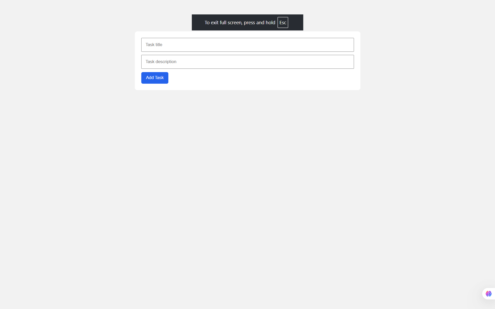

### Tasks Added

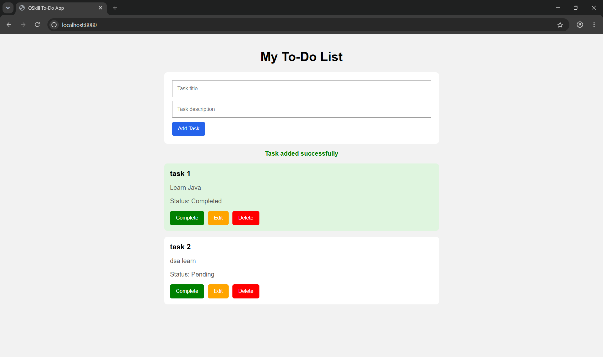

### Completed Task

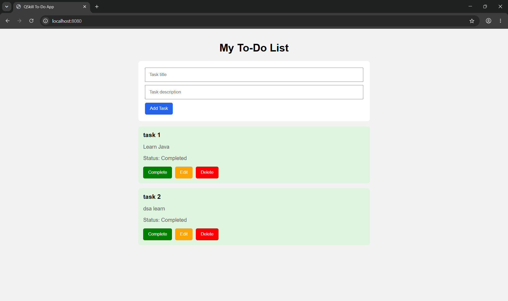

### Edit Functionality

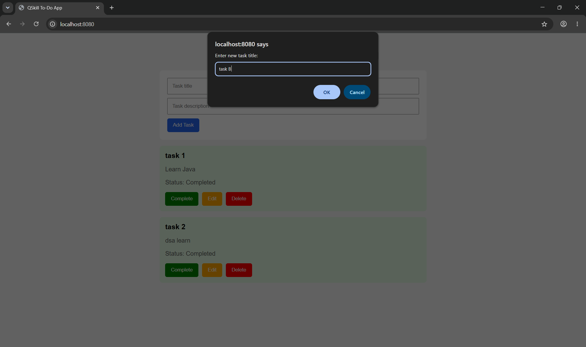

### Delete Functionality

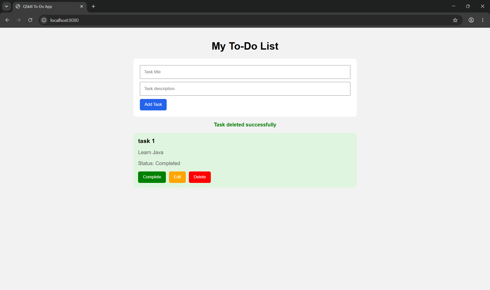

### Postman API Testing

#### GET - All Tasks

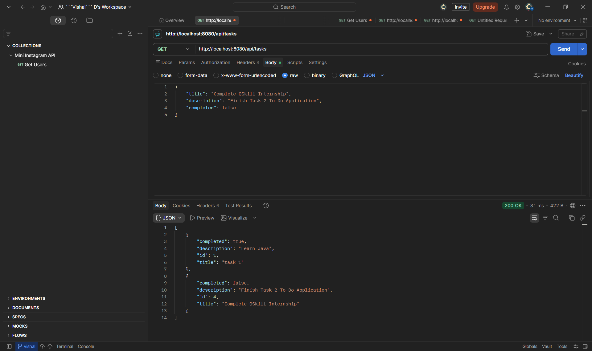

#### POST - Add Task

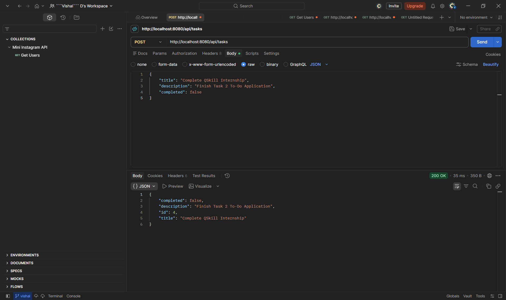

#### PUT - Update Task

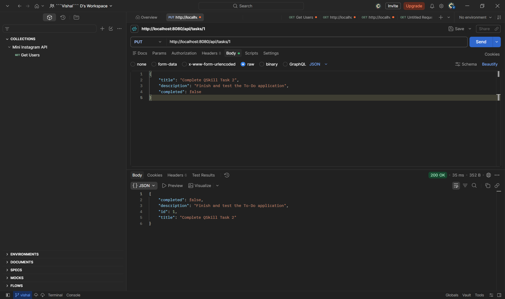

#### PUT - Complete Task

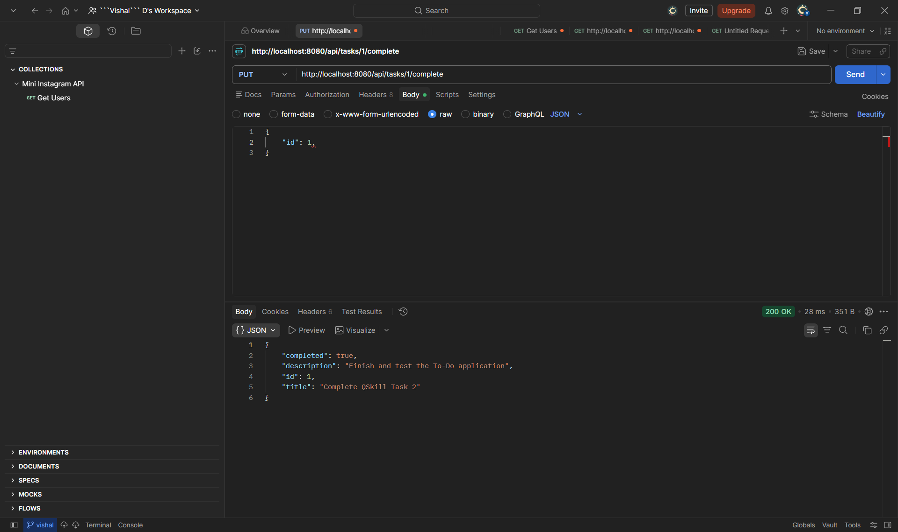

#### DELETE - Delete Task

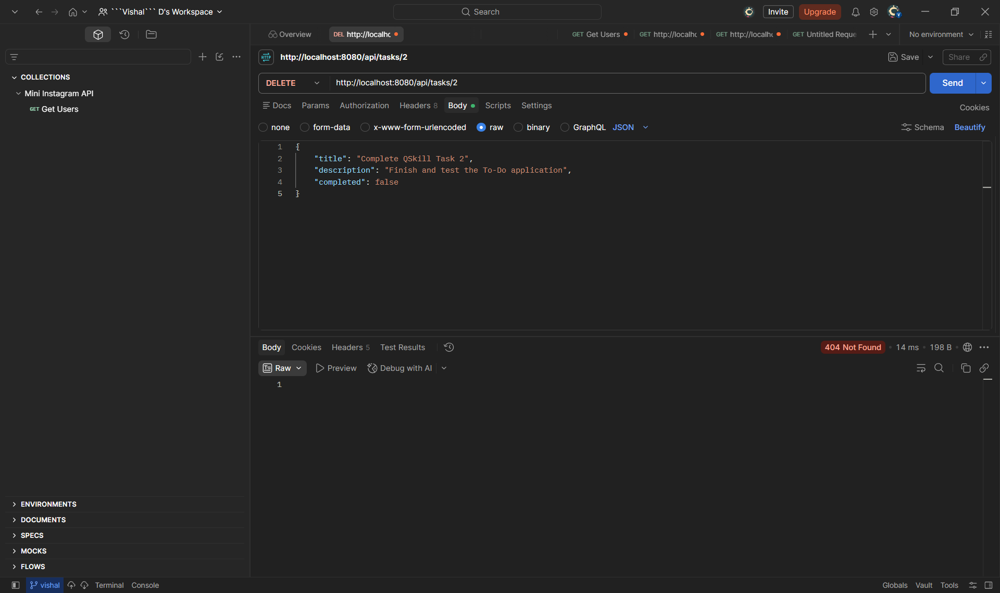

### MySQL Database

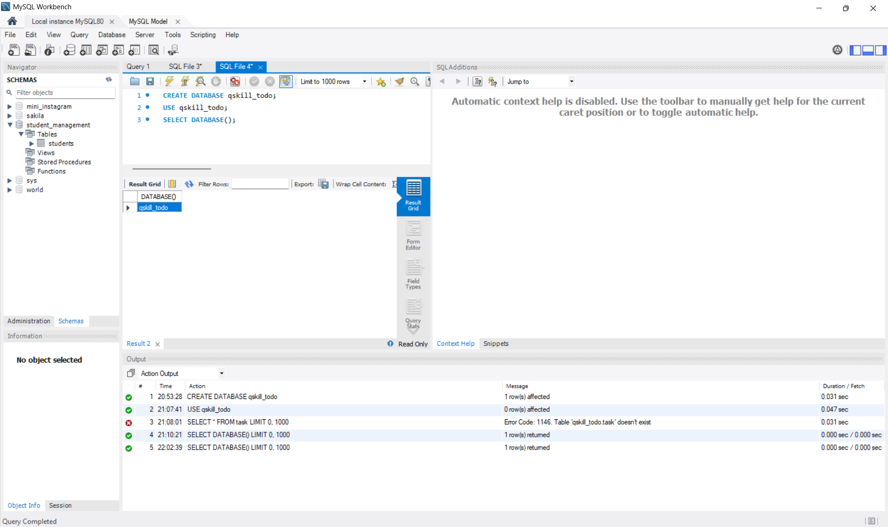

## Author

**Vishal D**
